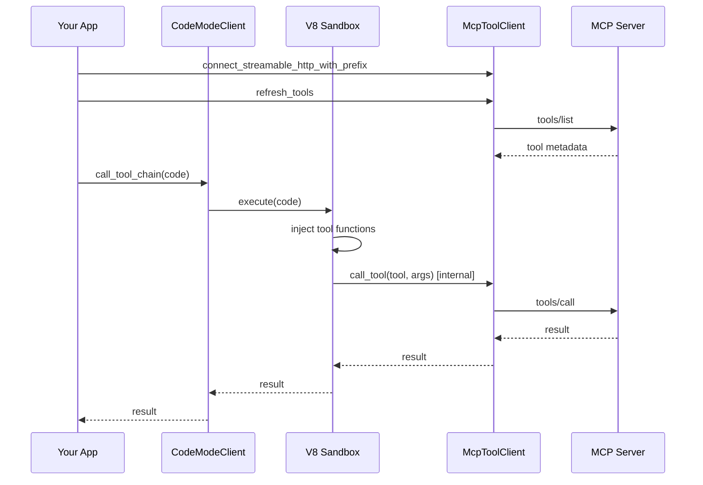
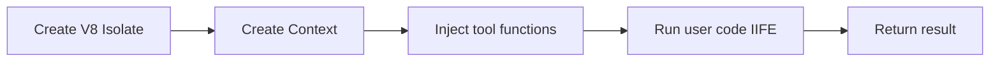

# codemode-rs

Rust port of CodeMode with an MCP-backed tool client and a V8 sandbox for running tool-aware JavaScript.

## Quick Start (Media MCP)

1) Start the Media MCP server:

```bash
cd ../media_mcp
just local-temporal
just dev-http
```

2) Run the example:

```bash
cargo run --example media_mcp_streamable_http
```

## Minimal Example

This is the simplest possible usage pattern: connect to an MCP server, refresh tools, run code.

```rust
use std::sync::Arc;

use codemode_rs::prelude::*;
use rmcp::service::ServiceExt;

#[tokio::main]
async fn main() -> Result<(), Box<dyn std::error::Error>> {
    let transport =
        rmcp::transport::StreamableHttpClientTransport::from_uri("http://localhost:3030/mcp");
    let service = ().serve(transport).await?;
    let mcp = McpToolClient::new(service);

    let config = CodeModeClientConfigBuilder::default()
        .sandbox(SandboxConfig::new(tokio::runtime::Handle::current()))
        .build()?;
    let mut client = CodeModeClient::new(config);
    client.register_async_source(mcp.clone(), "media").await?;

    let result = client
        .call_tool_chain(
            "const [scores, news] = await Promise.all([\
                media.get_live_scores({ sport: 'nfl' }),\
                media.search_news({ query: 'nfl' })\
            ]);\
            return { scores, news };",
        )
        .await?;
    println!("{}", result.result);
    Ok(())
}
```

## How It Works

- The MCP client fetches tool metadata and caches it locally.
- The sandbox builds JS functions for each tool directly in V8 (v8 crate).
- User code runs inside an async IIFE so `return` and `await` work.
- Tool calls return values for sync tools and Promises for async tools.

## Runtime Requirement

- A Tokio runtime is required. Provide `tokio::runtime::Handle::current()` when building `SandboxConfig`.
- Register async tools via `AsyncToolCaller` + `ToolMetadataProvider` (or use `register_async_source`).

### Execution Flow



### Sandbox Setup (Simplified)



## Notes

- Tool names with dots are injected as namespaces (e.g. `github.get_pull_request`).
- Flat tool names are injected directly (e.g. `get_live_scores`).
- If you register multiple MCP clients, use prefixes to avoid collisions.
- Async tools must have `is_async: true` so the JS bindings return Promises.
